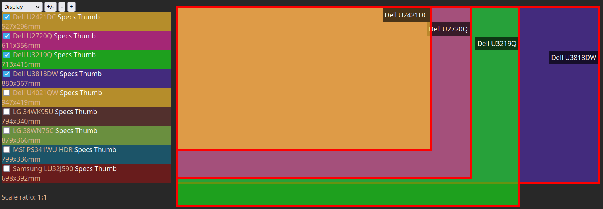

# What is it? #

This is bunch of JS scripts I wrote to help me decide what type of monitor I should get next. I was mostly concerned about screen
dimensions as well as display resolution and all this is can be visually compared.



# Usage #

Note, this is tool I wrote just for my own purpose, so no fancy configs, nice looking UI, sophisticated error handling nor other
usual stuff. If you want to play with it, you need to add specification of the displays you are comparing by directly editing
`monitors.js` script. The `monitors_src` array holds monitors as separate objects, i.e.

```json
    {
        label: "Dell U3219Q",
        model: "b96b14f5",
        display: {w: 713, h: 415},
        resolution: {w: 3840, h: 2160, freq: 60},
        checked: true
    },
```

where fields are:

* `label` is any string you want to be used as display label (ensure it's unique though),
* `model` is display model ID from [www.displayspecifications.com](https://www.displayspecifications.com/) site I was using. It is
  mostly used to construct reference link (if you need more specs) and to get the monitor image thumbnail,
* `display` specifies `w`idth and `h`eight of the display. The units are millimeters, but units are in fact quite irrelevant and can
  be anything you want. Just keep it the same for each monitor otherwise comparison would have no much sense.
* `resolution` specifies `w`idth, `h`eight (in pixels) and max. refresh `freq`uency of the display.
* `checked` determines if monitor is enabled `true` (default) or excluded from visual comparison (`false`).

Once you set it all up, just use any web browser and open `index.html` file and that's it. You do **NOT** need any webserver
installed nor running. It's all local. Just type `file://<PATH TO WHERE YOU GOT THESE FILES STORED>/index.html` in your browser
address bar and you should be good.

# License #

 * Written and copyrighted &copy;2020-2021 by Marcin Orlowski <mail (#) marcinorlowski (.) com>
 * This application is open-sourced software licensed under the [MIT license](http://opensource.org/licenses/MIT)

